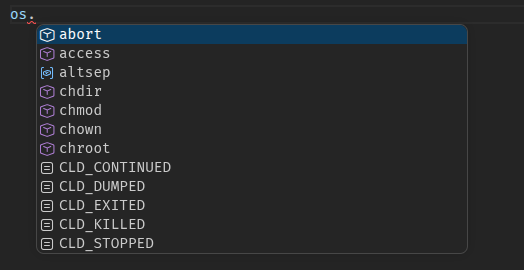
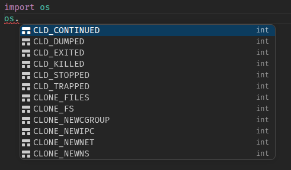

[repo](https://github.com/matan-h/pyhash-complete)

## Backstory

This story begins with me opening vscode with a python file and seeing this autocomplete:



I was in the middle of building a simple text editor,and I thought *how could vscode,the most popular code editor in the world, be so unoptimized for programmers*?

The autocomplete results were filled with functions I used at most once in my life, with some, like `CLD_CONTINUED` nowhere to be found, even on the entire public github.

Switching to [ty](https://github.com/astral-sh/ty) LSP (fastest,open source LSP) from pylance just highlights the problem (`basedpyright` didnt solve it either).

.

## The problem with alphabet sort for code

In [many](https://en.wikipedia.org/wiki/Lexicographic_order) cases,alphabet order is good. For UI, it looks good.. right?

- [Google Material](https://m2.material.io/components/lists#usage) - "Lists should be sorted in logical ways that make content easy to scan, such as alphabetical,..,or by user preference"

- [uxcel](https://uxcel.com/glossary/sorting) - "Can be alphabetical, numerical, or custom"

- [Apple HIG](https://developer.apple.com/design/human-interface-guidelines/layout#Visual-hierarchy) - "Place items to convey their relative importance"

- [NN/g](https://www.nngroup.com/articles/alphabetical-sorting-must-mostly-die/) - "..,prioritization by importance or frequency are usually better than A-Z listings..,People Rarely Think A–Z"

In programming, you type letter by letter, when you write `sys.a` you are (almost) certainly not thinking about `sys.abiflags` or `sys.activate_stack_trampoline` <offwhite> and if you were thinking about them, you are probably one of the only 10 people in the world who know about them :) </offwhite>

## Solutions

Some IDEs, like PyCharm, offer an AI-based autocomplete, this is usually very good autocomplete. However, it's slow, and usually off by default. When you type code you don't want your editor to run a full AI model (or even slower, a full LLM) for every letter you type.

Instead of training an AI to detect the rules of autocomplete so it could work with any module, all I actually needed was a simple table of most used functions/attrs for most common modules, which is going to account for most of the code anyway.

So, I used an existing python dataset, called [ManyTypes4PyDataset](https://github.com/saltudelft/many-types-4-py-dataset),v1.7 which contains 5.2K Python repositories, and I built a simple python script to count all calls to builtin functions or attributes that happened more than once. That results in a table like this one

| prefix     | score |
| ---------- | ----- |
| os.stat    | 1459  |
| os.environ | 8317  |

..~100,000 rows

However, just dumping this table would result in a big and slow file for no reason, so I designed a binary to make it faster. The Focus: *lookup speed*.

## Hash Score Table format

The first thing that takes up space here is the prefix string. Since the format is designed to be query only, no need to include the actual string (instead,it includes just the hash). The format uses a fast hash, FNV-1a , shifted to be 24-bit.

```yml
- Header (magic `HSCT`+version) - 8 bytes
- capacity and slot count - 8 bytes
- Slots hash table 4 bytes repeated:
    - Hash key (FNV-1a >> 8) - 3 bytes
    - frequency - 1 byte
```
(Using powers of 2 to avoid `%` operation on lookup)

The frequency is normalized into 1-255 range, so it can be stored with 1 byte.

By this point, I abandoned my python script, and migrated it to go (partly using an LLM, they are trained on go), as python was good as a prototype, but it was too slow to iterate every time on the 5k json files.

## Thresholds

Following the steps above gives a ~`4.4Mb file`, mostly full of things like `myClass.A()`,that are too specific. creating a classical name filter (`A.A`) only changes the file size to a ~`4.2Mb file`.

I added two new thresholds.

1. Filter by total number of calls (or accesses). For example, if `os.stat` was called 1459 times, it's probably because it's popular (raw)
2. Filter by number of projects calling. For example, if a function is called 1500 times only by a single project, it is probably **not** popular (proj)

These two thresholds very quickly changed the file size, as you can see in the interactive. Important calls/attr dropped appear below.

<section id="threshold-explorer">
<style>
#threshold-explorer {
  background: #111;
  padding: 16px;
}
#threshold-explorer input[type=range] { accent-color: #2dd027; }
#result-size { font-size: 1.6em; font-weight: bold; color: white; margin: 14px 0 2px; }
#result-keys { color: #666; }
#dropped-symbols {
  font-size: 11px;
  color: #666;
  border-top: 1px solid #222;
  padding-top: 10px;
  line-height: 1.8;
}
#dropped-symbols b { color: #e8c07d; }
#dropped-symbols span { color: #555; }
</style>

<form id="threshold-form">
  <label for="raw-range">raw ≥ <output for="raw-range" id="raw-output">1</output></label>
  <input type="range" id="raw-range" min="0" max="14" value="0">

<label for="proj-range">proj ≥ <output for="proj-range" id="proj-output">1</output></label>
<input type="range" id="proj-range" min="0" max="11" value="2">

</form>

<p id="result-size">—</p>
<p id="result-keys"></p>
<p id="dropped-symbols"></p>

<script>
  let distmap = null;
  let byId = document.getElementById.bind(document)
  let byIdv =(v)=>document.getElementById(v).value

  
  const RAW_THRESHOLDS  = [2,3,5,7,10,20,50,100,200,500,1000,2000,5000,10000,50000];
  const PROJ_THRESHOLDS = [1,2,3,5,7,10,20,50,100,200,500,1000];

  function formatBytes(bytes) {
    if (bytes >= 1048576) return (bytes / 1048576).toFixed(2) + ' MB';
    if (bytes >= 1024)    return Math.round(bytes / 1024) + ' KB';
    return bytes + ' B';
  }

  function render() {
    if (!distmap) return;

    const rawIndex  = Number(byIdv('raw-range'));
    const projIndex = Number(byIdv('proj-range'));

    byId('raw-output').value  = RAW_THRESHOLDS[rawIndex];
    byId('proj-output').value = PROJ_THRESHOLDS[projIndex];

    const cell = distmap.grid[rawIndex][projIndex];
    byId('result-size').textContent = "~"+formatBytes(cell.bytes);
    byId('result-keys').textContent = cell.count.toLocaleString() + ' keys';

    const dropped = [];
    for (const band of distmap.projLosses) {
      if (PROJ_THRESHOLDS[projIndex] > band.to)
        for (const ex of band.examples) dropped.push(ex);
    }
    for (const band of distmap.rawLosses) {
      if (RAW_THRESHOLDS[rawIndex] > band.to)
        for (const ex of band.examples) dropped.push(ex);
    }

  const droppedEl = byId('dropped-symbols');
droppedEl.textContent = '';

if (dropped.length) {
  droppedEl.append('top dropped: ');
  dropped.forEach((e, i) => {
    const b = document.createElement('b');
    b.textContent = e.key;
    const s = document.createElement('span');
    s.textContent = ` r=${e.r} p=${e.p}`;
    droppedEl.append(b, s);
    if (i < dropped.length - 1) droppedEl.append(' · ');
  });
}
  }

  byId('threshold-form').addEventListener('change', render);

  fetch('../assets/json/pyhash-distmap.json')
    .then(r => r.json())
    .then(data => {
      const lookup = Object.fromEntries(data.grid.map(c => [`${c.rt}_${c.pt}`, c]));
      distmap = {
        grid: RAW_THRESHOLDS.map(rt => PROJ_THRESHOLDS.map(pt => lookup[`${rt}_${pt}`])),
        rawLosses:  data.rawLosses,
        projLosses: data.projLosses,
      };
      render();
    });
</script>
</section>

## Result
 

There are many ways to use this table, you can look at the pyhash [repo](https://github.com/matan-h/pyhash-complete). I published prebuilt datasets in releases.

My ty [fork](https://github.com/matan-h/ruff-fork/tree/pyhash2) includes a table (raw threshold 7), hopefully it will be [merged](https://github.com/astral-sh/ruff/pull/24050) to ty sometime. In the meantime, [you can build it and use it manually](https://github.com/matan-h/pyhash-complete/blob/main/BUILD-TY.md)

---

This was one of the most interesting projects I've done. Looking at vscode from the viewpoint of a new editor developer presented the opportunity to do this.

"In all affairs, it's a healthy thing now and then to hang a question mark on the things you have long taken for granted" ~ Russell
